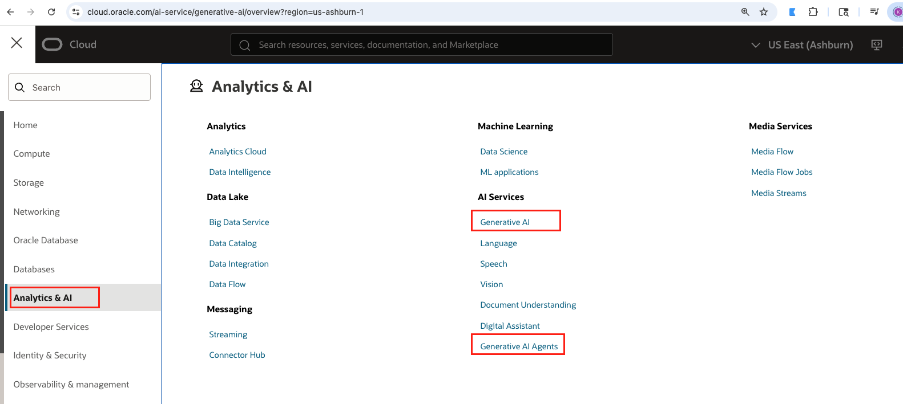

# Workshop: Enhance Guest Experience with OCI Generative AI

This workshop focuses on using **OCI Generative AI services** to enhance guest experiences and streamline hotel operations.  

You will assume the role of **Maria**, the General Manager of a hotel, who receives daily multilingual reviews from guests. The workshop will guide you on how to leverage AI to:  
- Summarize reviews  
- Analyze guest sentiment  
- Translate feedback into English  

This enables quick and effective responses that improve guest satisfaction.

The workshop is divided into two parts:

### **Lab 1: Enhance Guest Experience with OCI Generative AI**

In this lab, you will:  
- Use the **OCI Generative AI Playground**. 
- Work with a sample non-English review.  
- Summarize it, analyze its sentiment (**Positive, Negative, or Neutral**), and translate it into English.  

This task demonstrates how AI saves time while improving **accuracy** and **scalability** in handling guest reviews.

### **Lab 2:** 
**(a) Build an Agentic Hotel Concierge**. 

In this lab, you will:  
- Build a full-fledged **AI Concierge** using the **OCI Generative AI Agent Development Kit (ADK)**.  
- Create a **Knowledge Base** from a dataset of guest reviews to enable **Retrieval Augmented Generation (RAG)**.  
- Enable the concierge to identify patterns and respond to queries about the **entire guest feedback knowledge base**.  

         
**(b) Build a Data-Driven Concierge to Solve Problems in Real Time with OCI ADK**
In this lab, you will: 
- Extend the agent with **custom tools** (e.g., web search), allowing it to provide **proactive solutions** by combining historical insights with real-time context.  

---

Objectives 

In this workshop, you will learn how to:  

-  Use OCI Generative AI to summarize reviews in their original language  
-  Analyze sentiment (**Positive, Negative, or Neutral**) of guest feedback  
-  Translate reviews into English for hotel management  
-  Create a Knowledge Base in OCI Generative AI Agents using guest reviews  
-  Build an AI Concierge Agent with **RAG capabilities**  
-  Extend the agent with custom tools (**web search**) using the OCI Generative AI Agent Development Kit (ADK)  
-  Understand how AI improves response times, guest satisfaction, and revenue  

---

Prerequisites  

- Your tenancy must be subscribed to an **OCI region** with **Generative AI service** available.  
  👉 Refer to the [OCI documentation](https://docs.oracle.com/en-us/iaas/Content/home.htm) for available regions. We will use us-chicago-1 region for this lab.
- Familiarity with **Oracle Cloud Infrastructure (OCI)** is helpful.  

You may now proceed to the next lab.

---

Dataset  

The workshop uses a **multi-language TripAdvisor Hotel Reviews dataset**, provided in:  
- **CSV format**  
- **Markdown format**  

---

## Task1: Learn more

[Click here](https://www.oracle.com/artificial-intelligence/generative-ai/generative-ai-service/) to know about OCI Generative AI Service

---

## Acknowledgements  

**Authors:**  
- Felipe Garcia, Master Principal Cloud Architect 
- Karol Stuart, Master Principal Cloud Architect  

**Last Updated by/Date** – Karol Stuart, August 2025  
