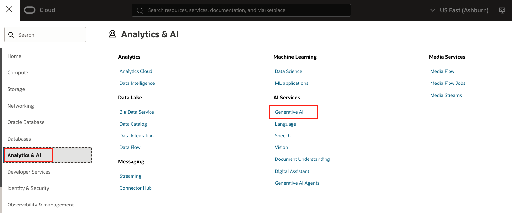
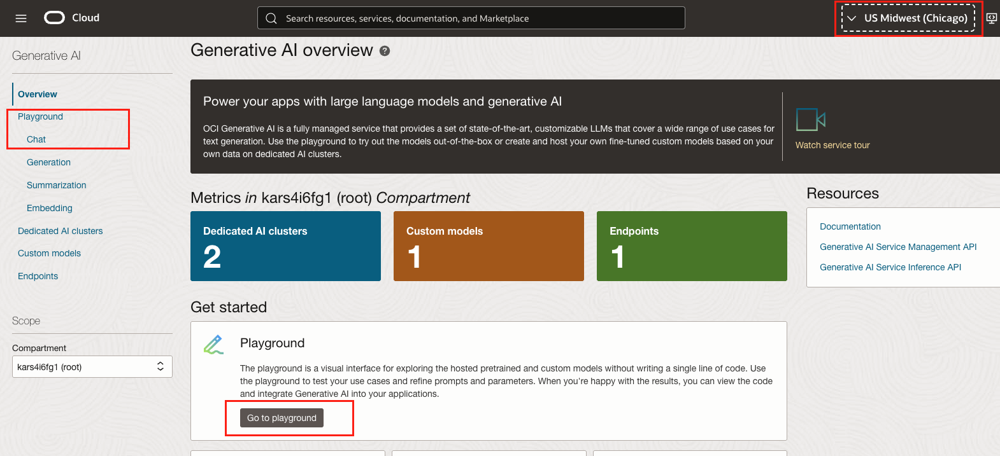
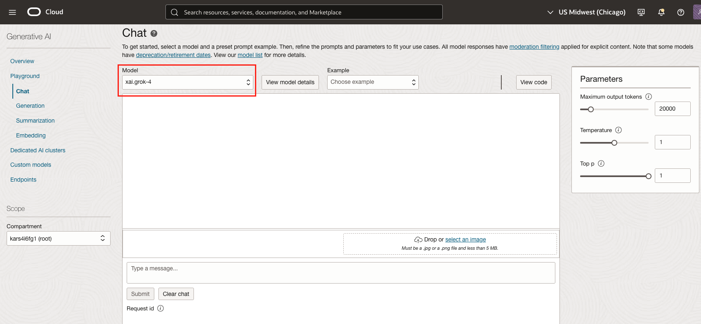
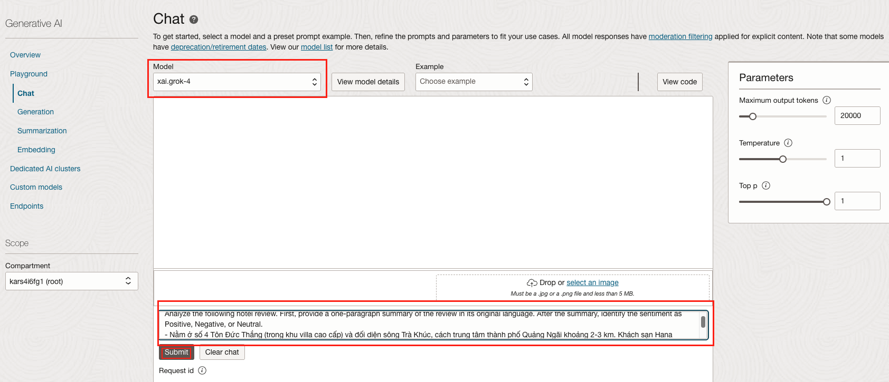
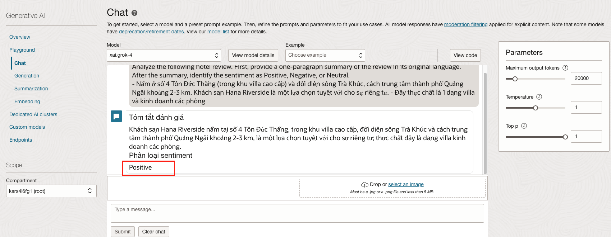
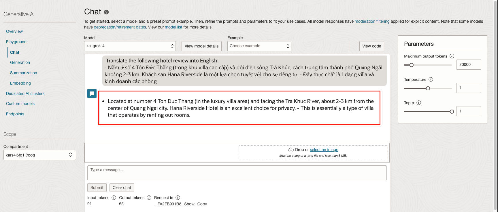

# OCI Generative AI Workshop: Enhance Guest Experience in Hospitality

## Introduction

This lab focuses on how hotels can enhance guest experiences using **OCI Generative AI**.  
You will step into the shoes of Maria, the General Manager of the Grand Plaza Hotel in Ho Chi Minh City, who receives multilingual reviews daily. With AI, you will learn to summarize reviews, analyze guest sentiment, and translate feedback into English helping managers act quickly and effectively.

Estimated Time: 15–20 minutes

### Objectives

In this lab, you will:

- Use OCI Generative AI to **summarize reviews** in their original language.
- **Analyze sentiment** (Positive, Negative, or Neutral).
- **Translate reviews** into English for hotel management.
- Understand how AI improves **response times**, **guest satisfaction**, and **revenue**.

### Dataset

We will use the multi-language TripAdvisor Hotel Reviews dataset from  
[Zenodo / NIAID ](https://data.niaid.nih.gov/resources?id=zenodo_7967493).  

A trimmed CSV dataset is provided in this repository under:  
[TripAdvisorReviewsMultiLang.csv](./datasets/TripAdvisorReviewsMultiLang.csv)  

---

## Task 1: Get Your Sample Text (5 minutes)

1. Open the CSV ( [TripAdvisorReviewsMultiLang.csv](./files/TripAdvisorReviewsMultiLang.csv) ) dataset. 
2. Copy one **non-English review** (e.g., Vietnamese, ).


---

## Task 2: Navigate to the OCI Generative AI Playground (5 minutes)
 
1. In the **OCI Console**, go to: **Analytics & AI → 'Generative AI' in AI Services **.  



2. Click **Go to Playground** or **Playground-->Chat** in the sidebar to open the interactive interface.



---

## Task 3: Summarize and Analyze the Review (8 minutes)

1. In the Playground, select a **Grok model** (e.g. xai.grok-3). Grok is a strong multilingual capabilities.  



2. Use the following prompt with your chosen review and click **Submit**.

   ```
   <copy>
   Analyze the following hotel review. First, provide a one-paragraph summary of the review in its original language. After the summary, identify the sentiment as Positive, Negative, or Neutral.

   Here is the review:
   [PASTE THE NON-ENGLISH REVIEW TEXT HERE]
   </copy>
   ```

   (e.g.)

   ```
   <copy>
   Analyze the following hotel review. First, provide a one-paragraph summary of the review in its original language. After the summary, identify the sentiment as Positive, Negative, or Neutral.
- Nằm ở số 4 Tôn Đức Thắng (trong khu villa cao cấp) và đối diện sông Trà Khúc, cách trung tâm thành phố Quảng Ngãi khoảng 2-3 km. Khách sạn Hana Riverside là một lựa chọn tuyệt vời cho sự riêng tư. - Đây thực chất là 1 dạng villa và kinh doanh các phòng
   </copy>
   ```

   
   

3. The model outputs a summary in the **original language** plus sentiment analysis.

   

---

## Task 4: Translate the Review (2 minutes)

1. Start a new chat in the Playground.  
2. Use the following prompt and click  **Submit** to get a full English translation:

   ```
   <copy>
   Translate the following hotel review into English:

   [PASTE THE SAME NON-ENGLISH REVIEW TEXT HERE]
   </copy>
   ```

   (e.g.)
   ```
   <copy>
   Translate the following hotel review into English.
- Nằm ở số 4 Tôn Đức Thắng (trong khu villa cao cấp) và đối diện sông Trà Khúc, cách trung tâm thành phố Quảng Ngãi khoảng 2-3 km. Khách sạn Hana Riverside là một lựa chọn tuyệt vời cho sự riêng tư. - Đây thực chất là 1 dạng villa và kinh doanh các phòng
   </copy>
   ```

   The model outputs the translated summary in  **English language**  
   
   ***Translated Text***

## Conclusion & Value

In this lab, you have:

- **Summarized** a review in its native language.  
- **Analyzed** guest sentiment for faster prioritization.  
- **Translated** the review into English for management use.  

### Business Impact

- **Time savings**: Responses in minutes, not days.  
- **Accuracy**: AI captures nuance and cultural context.  
- **Scalability**: Handle hundreds of reviews daily without additional staff.  

## What's Next

In **Lab 2**, you will build an **AI Concierge** to analyze thousands of reviews at once, discover patterns, and recommend actions. This step takes you from **single-review analysis** to **strategic intelligence** for hospitality management.

---

## Acknowledgements  

**Authors:**  
- Felipe Garcia, Master Principal Cloud Architect 
- Karol Stuart, Master Principal Cloud Architect  

**Last Updated by/Date** – Karol Stuart, August 2025  
