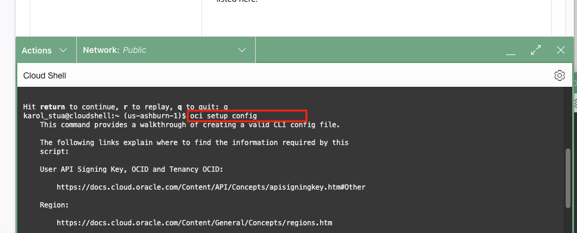

# Lab 2: Build an Agentic Hotel Concierge

### Introduction
This lab guides you through creating an AI Concierge. In this version, we'll use a Python script to quickly create all the necessary components (agent, knowledge base, and tools) automatically.

Three months after implementing her AI review analysis system, Maria, General Manager of the Grand Plaza Hotel, can now quickly understand and respond to guest reviews in multiple languages, greatly improving guest satisfaction ⭐⭐⭐⭐⭐ and response times ⏱️. A new challenge arose: identifying patterns across complaints like noisy construction, slow Wi-Fi, or event disruptions. Manually tracking these across spreadsheets and review platforms is slow and error-prone.

The solution is an AI Concierge 🛎️ using Retrieval Augmented Generation (RAG) that can instantly search thousands of reviews, identify trends, provide context-aware responses, and solve real-time issues. Maria can now ask the AI questions like *"How many guests reported Wi-Fi issues this month?"* or *"What event disrupted guests last weekend?"* and get instant insights.

### Objectives
In this lab, you will build the AI Concierge using Retrieval Augmented Generation (RAG) and complete three main tasks:

- Run a script to upload the dataset and create the KnowledgeBase and agent.  
- Create and Test your First Agent with Retrieval Augmented Generation (RAG).  

### Prerequisites
This lab assumes you have the following:

- Access to Oracle Cloud Infrastructure (OCI), paid account or free tier, in a region that has Generative AI.  
- Basic experience with OCI Cloud Console and standard components.  
- The `handson-lab` repository cloned.  

Estimated Time:  45-50 minutes

Tasks
---

## Task 1: Create ObjectStorage, Knowledge-base and Agent
In this task, you'll run the cloud shell to run a script before we test the AI agents. This script will create object storage, knowledge-base and Agents. 


1.  Setup OCI config file
    
    Open Cloud Shell from the top-right corner of the OCI Console, 

    

    then run the following command to start the guided setup:
    
    ```bash
    <copy>
    oci setup config
    </copy>
    ```

    Follow the prompts and enter the required details when asked:
    -   Enter a location for your config [Click Enter]
    -   Tenancy OCID (Enter your tenancy OCID, refer screenshots below)
    -   User OCID (enter our user OCID, refer screenshots below)
    -   Region (give us-chicago-1)
    -   Enter 'Y' to generate API signing Key
    -   Path to the directory of the public and private key files (press Enter to let it generate automatically)
    -   Enter Passphrase and reconfirm as "N/A"


        

        

        

          

    Once completed, a private key will be created locally, and a public key will be generated. To view the newly created public key, run:
    
    ```bash
    <copy>
    cat ~/.oci/oci_api_key_public.pem
    </copy>
    ```       

    Copy the entire output and paste it into the OCI Console under:    Profile → Tokens & Keys → Add API Key → Paste a Public Key    

            


    Verify your config file works:    

    ```bash
    <copy>
    oci os ns get
    </copy>
    ```

    If it returns your namespace, your config is correctly set up .
    
      

2.  Run the following command to check if the region is set to us-chicago-1. 

    ```bash
    <copy>
    awk -F= '/^region/ {print $2}' ~/.oci/config
    </copy>
    ```

3.  Copy the [setup.py](./files/setup.py) and [TripAdvisorReviewsMultiLang.md](./files/TripAdvisorReviewsMultiLang.md) file to your local machine.Drag and drop inside the Cloud Shell. 

    

4.  Check python script >3.9 and run setup.py in CloudShell.

    *Note: If you are deploying resources into a compartment other than the root compartment, you need to provide the Compartment OCID, which you can find in the OCI Console by clicking your Profile (email) on top right, selecting Compartments from the side menu, choosing the appropriate compartment, and copying its OCID.*

    ```bash
    <copy>
    python -V
    python setup.py
    </copy>
    ```
    OR

    ```bash
    <copy>
    python -V
    python setup.py --compartment-id xxxxxxxxYOUR_COMPARTMENT_IDxxxxxx_ocid1.compartment.oc1..xxxxxxxxx
    </copy>
    ```

    

    *Note:* 

    *If you run the script in your own tenancy and if you get any error on limits, you need to request to increase the Generative-Agent count, Knowledgebase count and Agent Endpoint count limits.*

    
    

5.  View the newly created storage bucket and the uploaded dataset in the UI.

        
        

6.  Explore your newly created knowledge base and the data source in the UI.

        
        

7.  Confirm that the agents have been created successfully in the UI.

        

## Task 2: Test Your RAG agent

    Once the agent is active, click Launch chat. Test its knowledge from the dataset to confirm the RAG tool is working.

    ```
    <copy>
    "Summarize the most common positive comments people make about their rooms."
    "Are there any negative reviews that mention the check-in process?"
    </copy>
    ```


---

## Acknowledgements  

**Authors:**  
- Felipe Garcia, Master Principal Cloud Architect 
- Karol Stuart, Master Principal Cloud Architect  

**Last Updated by/Date** – Karol Stuart, August 2025  
