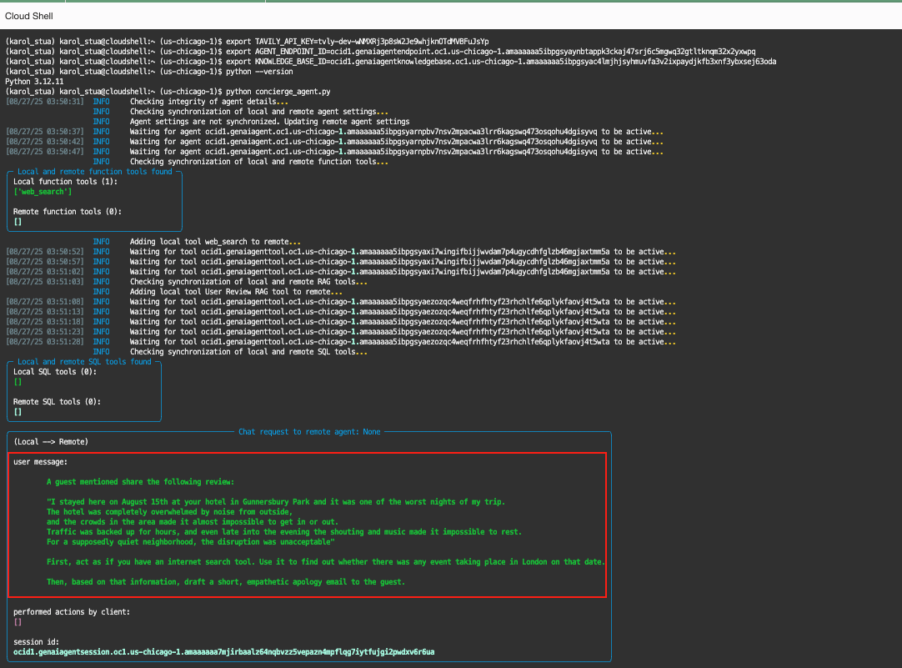

# Lab 2B: Build a Data-Driven Concierge to Solve Problems in Real Time with OCI ADK

### Introduction
In this lab, we take Maria’s hotel AI journey to the next level.  
Previously, you built a foundation using Retrieval Augmented Generation (RAG) to allow Maria’s AI concierge to analyze and retrieve insights from guest feedback. Now, you’ll extend those capabilities with **live tool integration** powered by the **OCI Agent Development Kit (ADK)**.  

By the end of this lab, you’ll have a **Problem-Solving Concierge**—an intelligent assistant that not only understands historical data but can also **search the internet in real-time**, giving Maria’s team the ability to resolve guest issues proactively.  

### Objectives
In this lab, you will verify the agent ADK creation from last step and run the AI Concierge using Retrieval Augmented Generation (RAG) with Live Tool support.  

### Prerequisites
This lab assumes you have the following:

- Access to Oracle Cloud Infrastructure (OCI), paid account or free tier, in a region that has Generative AI.  
- Basic experience with OCI Cloud Console and standard components.  
- The `handson-lab` repository cloned.

Estimated Time:  25-30 minutes
Tasks
---

## Task 1: Verify if agent is created 

1. Verify if Agent ADK is created. Go to Genertive AI Agent Services and verify if the "Hotel_Concierge_Agent_ADK" Agent is created. 


## Task 2: Run your RAG agent

Before running the agent, follow these setup steps in your Cloud Shell to prepare the Python environment (version >3.12) and install required dependencies:

1.  Set Python version

    ```
    <copy>
    csruntimectl python set python-3.12
    </copy>
    ```

2. Install uv and create virtual environment
    ```
    <copy>
    curl -LsSf https://astral.sh/uv/install.sh | sh
    export PATH="$HOME/.local/bin:$PATH"  # Add to ~/.bashrc for persistence
    uv --version
    uv venv
    </copy>
    ```

3. Activate virtual environment
    ```
    <copy>
    source .venv/bin/activate
    </copy>
    ```

4. Ensure pip is available and upgraded
    ```
    <copy>
    python -m ensurepip --upgrade
    python -m pip install --upgrade pip
    </copy>
    ```

5. Install required dependencies
    ```
    <copy>
    pip install "oci[adk]" rich PyYAML requests
    </copy>
    ```
6. Verify installation
    ```
    <copy>
    python -m pip show rich
    python -m pip show oci
    python -m pip show oci-adk
    </copy>
    ```

7. Set environment variables
    -   Create an account in [https://www.tavily.com](https://www.tavily.com) and signup and get the API Key.

        
        

    -   Get the AGENT ENDPOINT OCID from the UI.
        
    
    -   Get the Knowledge base OCID from the UI. 

        

    Now, you have the TAVILY API Key, Agent endpoint OCID and Knoweldgebase OCID, create below export commands and run it in Cloud-shell. 
    ```
    <copy>
    export TAVILY_API_KEY=xxxxxxxxxxxxxxxxxxxxxxxxxxxxxxxxxxxxxxxxxxxxxxxxxxxxxx
    export AGENT_ENDPOINT_ID=xxxxxxxxxxxxxxxxxxxxxxxxxxxxxxxxxxxxxxxxxxxxxxxxxxx
    export KNOWLEDGE_BASE_ID=xxxxxxxxxxxxxxxxxxxxxxxxxxxxxxxxxxxxxxxxxxxxxxxxxxx
    </copy>
    ```
8. Download the [concierge_agent.py](./files/concierge_agent.py) to your local. Drag and drop the files into cloud shell. Make sure your python is >3.12 version  and run the Concierge Agent python script
    ```
    <copy>
    python --version
    python concierge_agent.py
    </copy>
    ```

This will start the agent and allow you to test its Retrieval Augmented Generation (RAG) capabilities.


The script will use the **OCI Agent Development Kit (ADK)** to provision all necessary resources in your OCI tenancy.  

## Task 3: Verify the results.
The script you ran will send a query to the agent. The agent should use **Retrieval Augmented Generation (RAG)** to provide a context-aware response based on:  

- The dataset you uploaded  
- Real-time web crawls  




Verify the responses carefully. You should see:  

- Answers grounded in Maria’s hotel feedback dataset  
- Additional details fetched in real-time from external sources  
- A seamless blend of historical data and live information  


**Conclusion**  

🎉 Congratulations! You've successfully transformed Maria's hotel guest feedback system from a **manual, reactive process** into an **intelligent, proactive AI-powered solution**.  

### What You’ve Accomplished:
- **Part 1 – RAG Foundation:** Built a knowledge base for Maria’s AI agent to instantly analyze thousands of guest reviews, identify patterns, and surface insights.  
- **Part 2 – Real-World Problem Solving:** Extended the agent with live web search capabilities, empowering it to resolve guest issues with both historical data and current events.  

### The Business Impact for Maria:
- **Faster Response Times:** From hours of manual research to instant answers  
- **Proactive Problem Solving:** Detect and fix issues before they affect many guests  
- **Improved Guest Satisfaction:** More accurate and context-aware responses  
- **Operational Efficiency:** Freeing staff to focus on high-value interactions  

### Maria’s Transformation Journey:
- **Lab 1 – Start Simple:** Analyze individual reviews in any language  
- **Lab 2, Part 1 – Scale with RAG:** Gain insights from the full guest feedback database  
- **Lab 2, Part 2 – Extend with Tools:** Integrate real-time web intelligence  

### Back in Ho Chi Minh City:
Maria’s Grand Plaza Hotel can now:  
- Spot recurring issues like Wi-Fi outages across dozens of reviews  
- Search live news (e.g., marathon disruptions) to explain guest complaints  
- Draft personalized, proactive responses to prevent escalations  

### The Journey Forward:
This is just the beginning. With this foundation, Maria can expand her AI concierge to:  
- Predict guest needs before they arise  
- Handle increasingly complex requests  
- Continuously improve with feedback-driven learning  

From **language barriers** to **pattern recognition** and now **real-time problem solving**, Maria’s journey reflects how AI can completely transform hospitality management—taking her hotel from **reactive to proactive, overwhelmed to empowered, and manual to intelligent**. 


## Task 4: Cleanup

At the end of this lab, make sure to clean up the resources created so you don’t consume unnecessary quota or incur additional costs.

Download the ["cleanup.py"](./files/cleanup.py) file.

Drag and drop to cloud shell to upload it into your Cloud Shell environment and run the cleanup script:
        ```
        <copy>
        source .venv/bin/activate   # if not already activated
        python cleanup.py
        </copy>
        ```


This script will delete:

-   Object Storage buckets created for this lab
-   Knowledge Base resources
-   AI Agents and Agent Endpoints

Once cleanup is complete, confirm in the OCI Console that the resources have been removed.

---

## Acknowledgements  

**Authors:**  
- Felipe Garcia, Master Principal Cloud Architect 
- Karol Stuart, Master Principal Cloud Architect  

**Last Updated by/Date** – Karol Stuart, August 2025  
